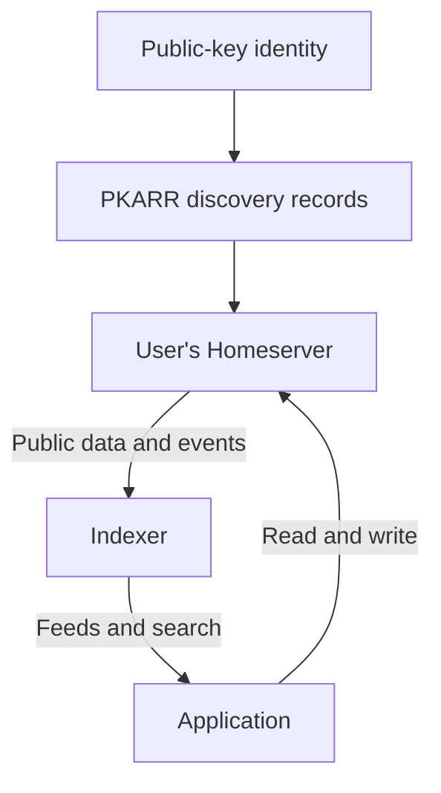

Pubky separates identity and discovery from storage and application-specific indexing. This lets an application use a user's Homeserver directly or build a shared view of data from several Homeservers.

| Component | Responsibility | Maintained documentation |
| --- | --- | --- |
| PKARR | Publish and resolve signed discovery records | [PKARR documentation](https://github.com/pubky/pkarr/blob/main/docs/introduction.md) |
| Homeserver | Store user data and enforce access permissions | [Homeserver documentation](https://github.com/pubky/pubky-homeserver#readme) |
| SDK | Connect applications to discovery, authorization, and storage | [SDK guides](/explore/pubky-protocol/sdk/) |
| App Specs | Define interoperable social data | [App Specs](/explore/pubky-apps/app-specs/) |
| Nexus | Index public social data and serve derived views | [Nexus documentation](/explore/pubky-apps/indexing-and-aggregation/pubky-nexus/) |

## Following a social post

A social client writes a post to the user's Homeserver. Nexus reads public changes, validates them against the App Specs, and indexes them. Clients query Nexus for feeds and search results. The index is a derived view; changing or removing an index entry does not change the original Homeserver file. The [pubky.app reference architecture](/explore/pubky-apps/reference-app/pubky-app/) follows this journey through the frontend's local cache, storage, and indexing.

Discovery records are signed. Stored application files are not automatically signed by the protocol, so clients also trust the Homeserver for their contents. See the [Security Model](/explore/pubky-protocol/security-model/) for the trust boundaries.

For choosing between direct storage access and an indexer, see [App Architectures](/explore/pubky-apps/app-architectures/introduction/). For hosting portability and its limits, see [Credible Exit](/explore/concepts/credible-exit/).
