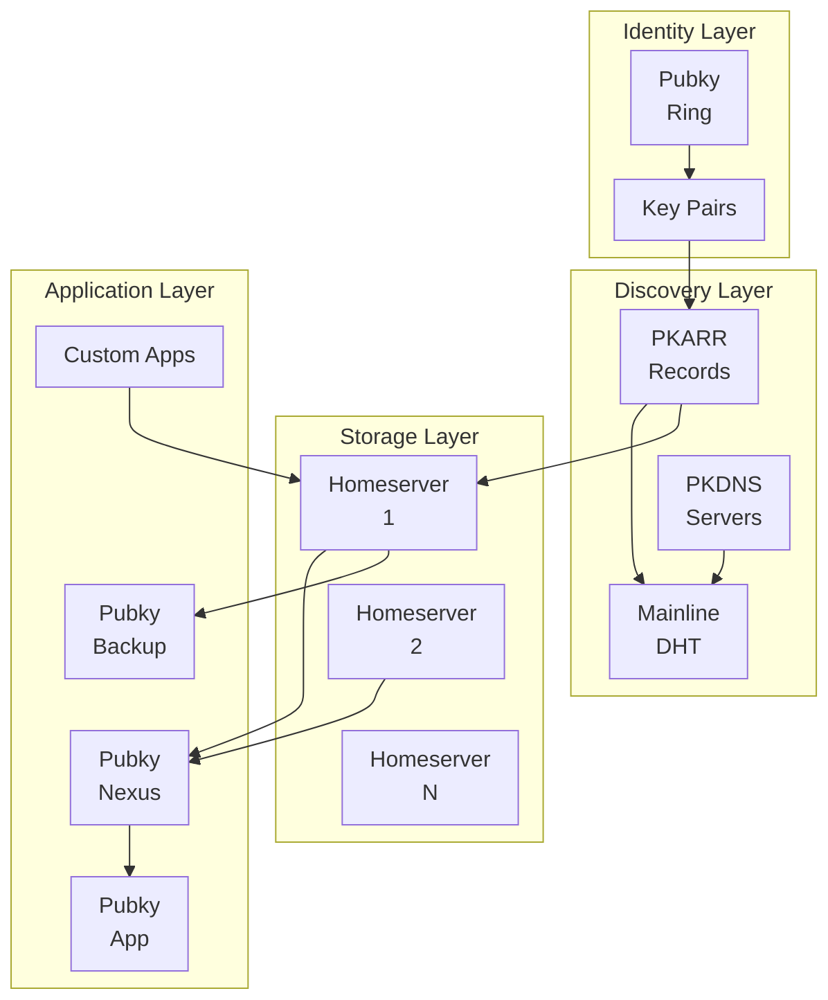
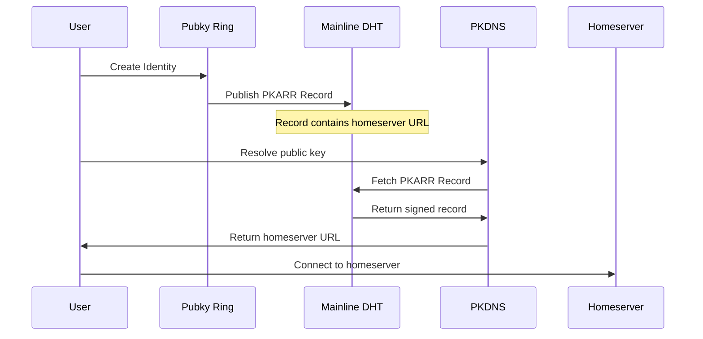
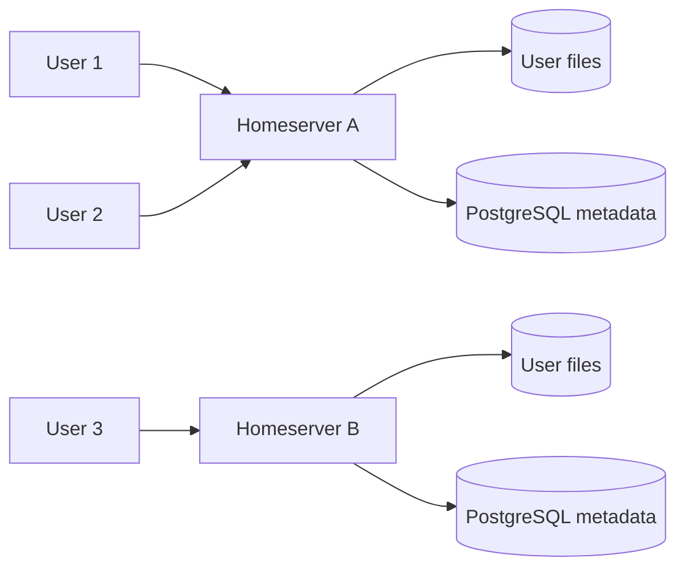
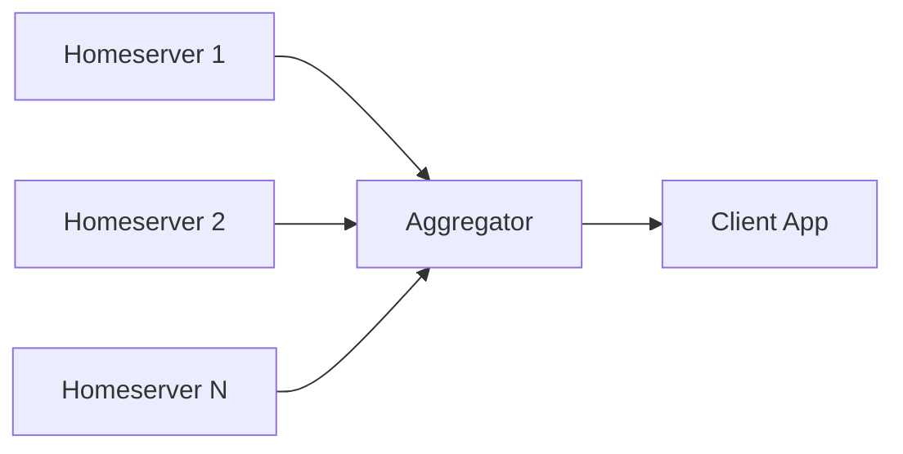
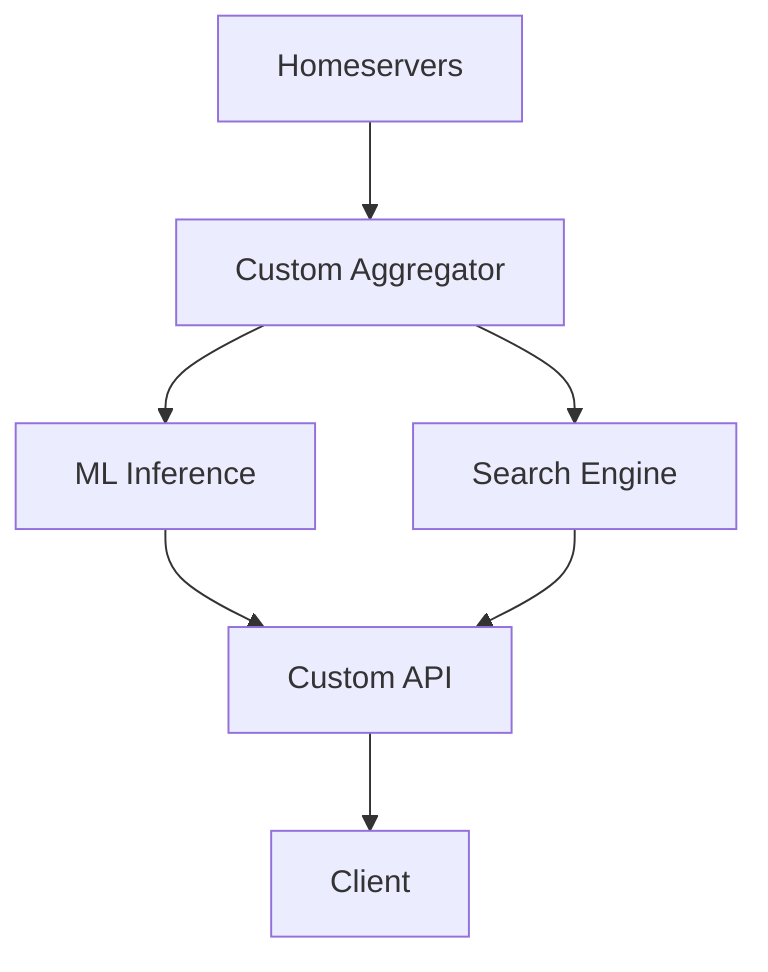
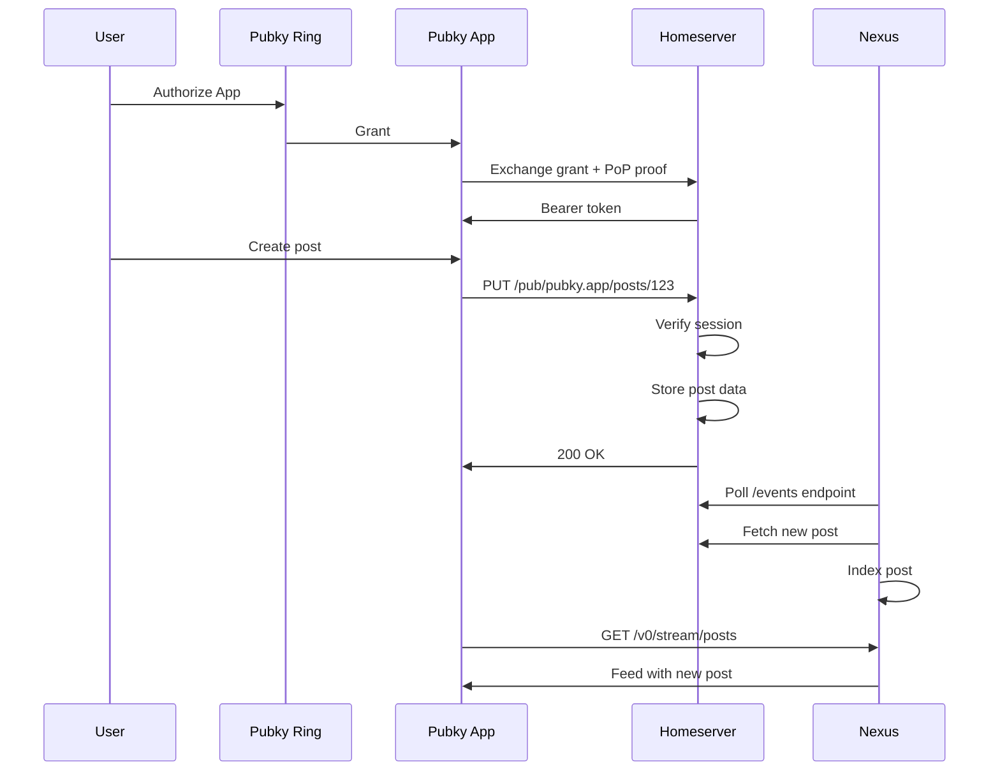

This page provides a comprehensive overview of the Pubky ecosystem architecture, showing how all components work together to enable decentralized, censorship-resistant applications.

---

## System Architecture

```mermaid
%%{init: {'flowchart': {'useMaxWidth': false, 'nodeSpacing': 16, 'rankSpacing': 25, 'padding': 10, 'subGraphTitleMargin': {'top': 4, 'bottom': 12}}}}%%
flowchart TB
    subgraph Identity[Identity Layer]
        Ring["Pubky<br/>Ring"]
        Keys[Key Pairs]
    end

    subgraph Discovery[Discovery Layer]
        PKARR["PKARR<br/>Records"]
        DHT["Mainline<br/>DHT"]
        PKDNS["PKDNS<br/>Servers"]
    end

    subgraph Storage[Storage Layer]
        HS1["Homeserver<br/>1"]
        HS2["Homeserver<br/>2"]
        HSN["Homeserver<br/>N"]
    end

    subgraph Apps[Application Layer]
        PubkyApp["Pubky<br/>App"]
        Nexus["Pubky<br/>Nexus"]
        Backup["Pubky<br/>Backup"]
        Custom[Custom Apps]
    end

    Ring --> Keys
    Keys --> PKARR
    PKARR --> DHT
    PKDNS --> DHT
    PKARR --> HS1
    HS1 --> Nexus
    HS2 --> Nexus
    HS1 --> Backup
    Nexus --> PubkyApp
    Custom --> HS1

    %% Invisible links stack components without adding relationships.
    PKARR ~~~ PKDNS
    HS1 ~~~ HS2
    HS2 ~~~ HSN
    Backup ~~~ Nexus
```

---

## Layer Breakdown

### Identity Layer

The foundation of Pubky is cryptographic identity based on **[key pairs](/build/security-model/#key-custody)**.

**Components:**
- **[Pubky Ring](/use/pubky-ring/)**: Mobile app for secure key management
- **Key Pairs**: Ed25519 public/private key pairs
- **Recovery Files**: Encrypted backups for key recovery

**How It Works:**
1. User generates a key pair (public + private key)
2. Public key becomes permanent identity (z-base-32 encoded)
3. Private key stays secure on device, used for signing
4. Recovery file enables backup and cross-device usage

**Key Properties:**
- ✅ Self-sovereign (no registration with authorities)
- ✅ Portable across devices
- ✅ Permanent (never changes)
- ✅ Cryptographically secure

---

### Discovery Layer

The discovery layer enables finding Homeservers and resolving identities without central servers.

**Components:**
- **[PKARR](/components/pkarr/)**: Public Key Addressable Resource Records
- **[Mainline DHT](/components/mainline-dht/)**: Distributed Hash Table (10M+ nodes)
- **[PKDNS](/components/pkdns/)**: DNS servers for resolving public-key domains

**How It Works:**

```mermaid
sequenceDiagram
    participant User
    participant Ring as Pubky Ring
    participant DHT as Mainline DHT
    participant PKDNS
    participant HS as Homeserver

    User->>Ring: Create Identity
    Ring->>DHT: Publish PKARR Record
    Note over DHT: Record contains homeserver URL
    User->>PKDNS: Resolve public key
    PKDNS->>DHT: Fetch PKARR Record
    DHT->>PKDNS: Return signed record
    PKDNS->>User: Return homeserver URL
    User->>HS: Connect to homeserver
```

**Key Features:**
- Decentralized discovery (no central directory)
- Censorship resistant (15+ years proven infrastructure)
- Self-published (users control their records)
- Updateable (switch Homeservers anytime)

---

### Storage Layer

**[Homeservers](/components/homeserver/)** store user data in a filesystem over a simple HTTP API, similar to WebDAV.

**Architecture:**

```mermaid
flowchart LR
    User1[User 1] --> HS1[Homeserver A]
    User2[User 2] --> HS1
    User3[User 3] --> HS2[Homeserver B]

    HS1 --> FS1[(User files)]
    HS1 --> PG1[(PostgreSQL metadata)]
    HS2 --> FS2[(User files)]
    HS2 --> PG2[(PostgreSQL metadata)]
```

**Key Properties:**
- **User Choice**: Pick any Homeserver or run your own
- **Data Ownership**: You control your data
- **Portability**: Switch Homeservers without losing data
- **Storage layout**: Files for user data; PostgreSQL for the Homeserver's internal metadata

Applications manage user files through the [SDK](/build/sdk/). For direct HTTP integrations, use the maintained [client OpenAPI specification](https://github.com/pubky/pubky-homeserver/blob/{{pinned_homeserver_release}}/pubky-homeserver/openapi-client.yml).

---

### Application Layer

Applications consume data from Homeservers, either directly or through aggregation services.

**Architecture Patterns:**

#### 1. Simple Client-Homeserver

```mermaid
flowchart LR
    Client[Client App] <--> HS[Homeserver]
```

**Use Case**: Personal apps, simple tools, direct data access

#### 2. Global Aggregator

```mermaid
flowchart LR
    HS1[Homeserver 1] --> Agg[Aggregator]
    HS2[Homeserver 2] --> Agg
    HS3[Homeserver N] --> Agg
    Agg --> Client[Client App]
```

**Use Case**: Social feeds, search, discovery (e.g., [Pubky Nexus](/components/pubky-nexus/))

#### 3. Custom Backend

```mermaid
flowchart TB
    HS[Homeservers] --> Agg[Custom Aggregator]
    Agg --> ML[ML Inference]
    Agg --> Search[Search Engine]
    ML --> API[Custom API]
    Search --> API
    API --> Client[Client]
```

**Use Case**: Advanced features, recommendations, specialized processing

---

## Data Flow Example: Publishing a Post

```mermaid
sequenceDiagram
    participant User
    participant Ring as Pubky Ring
    participant App as Pubky App
    participant HS as Homeserver
    participant Nexus

    User->>Ring: Authorize App
    Ring->>App: Grant
    App->>HS: Exchange grant + PoP proof
    HS->>App: Bearer token
    User->>App: Create post
    App->>HS: PUT /pub/pubky.app/posts/123
    HS->>HS: Verify session
    HS->>HS: Store post data
    HS->>App: 200 OK
    Nexus->>HS: Poll /events endpoint
    Nexus->>HS: Fetch new post
    Nexus->>Nexus: Index post
    App->>Nexus: GET /v0/stream/posts
    Nexus->>App: Feed with new post
```
