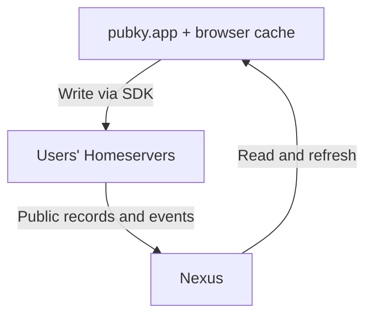

[pubky.app](https://pubky.app) is a social application and reference implementation built on the [Pubky protocol](/explore/pubky-protocol/introduction/). People publish posts, follow one another, and discover content through feeds and tags. Developers can study how it combines user-controlled storage with an indexed social graph and a responsive web interface.

## Tags and perspectives

Tags are free-text labels people apply to profiles and posts, including those written by someone else. Each annotation records who applied the label and what it describes. A post might be tagged `tutorial` by one reader and `privacy` by another; those labels add context beyond a single like count.

Perspectives are saved views of a feed, combining filters and presentation settings. They let readers return to a particular view of the social data. Tags and follow relationships provide the building blocks for the broader [semantic social graph](/explore/concepts/semantic-social-graph/).

Bookmarks are [public social records](https://github.com/pubky/pubky-app-specs/blob/main/SPEC.md#pubkyappbookmark). Treat bookmarked links as public data.

## Reference architecture

The application separates publishing, indexing, and presentation:

1. **The frontend keeps data locally.** Its browser database holds records and feed data so the interface can show cached content and respond to user actions promptly.
2. **Users publish to Homeservers.** The [SDK](/explore/pubky-protocol/sdk/) writes social records using the user's authorization. The records follow [App Specs](/explore/pubky-apps/app-specs/) so other compatible apps can understand them.
3. **Nexus follows changes.** Homeserver event feeds let [Nexus](/explore/pubky-apps/indexing-and-aggregation/pubky-nexus/) discover updates, fetch public records, and index content and relationships across users.
4. **The frontend refreshes from Nexus.** Indexed results update the local cache, which the interface reads to present feeds, profiles, and search results.

Local changes and indexed views do not become visible everywhere at once: the Homeserver write and subsequent Nexus indexing must complete. The upstream [local-first design](https://github.com/pubky/pubky-app/blob/dev/docs/local-first.md) explains the read, write, and refresh behavior in detail.

## Building on the same data

Another app can reuse the social data without adopting pubky.app's interface. It can read known records directly from Homeservers, query Nexus for indexed views, and contribute compatible records with the user's authorization. For example, a topic reader could use existing profiles and follow relationships while presenting a different feed.

[App Specs](/explore/pubky-apps/app-specs/) explains this interoperability and Universal Tags, which let applications add annotations to resources beyond pubky.app posts and profiles. Choose the pieces your app needs; the [app architecture guide](/explore/pubky-apps/app-architectures/introduction/) covers the alternatives.

For development and integration, use the maintained sources:

- [App repository](https://github.com/pubky/pubky-app): source code and development setup.
- [Developer documentation](https://github.com/pubky/pubky-app/blob/dev/docs/README.md): architecture, data flow, local storage, PWA behavior, and configuration.
