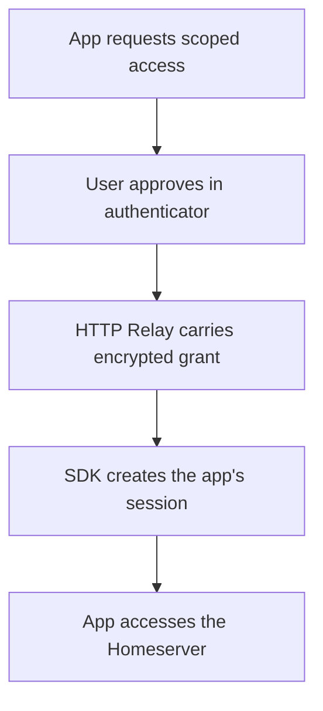

Pubky apps request scoped access to a user's Homeserver through grant authentication. A key manager such as [Pubky Ring](/explore/technologies/pubky-ring/) lets the user approve the request without giving the app their identity key.

## From approval to a session

An application asks for the permissions its features need, such as reading and writing files in its own storage path. It presents an authorization link or QR code. The user reviews the request in their authenticator, which approves access and delivers an encrypted grant through an [HTTP Relay](/explore/technologies/http-relay/). The SDK turns that approval into a session the app can use for authenticated requests.

The app's session is distinct from the identity key. Its permissions limit what it can do, and grants can be revoked. Reading someone else's public data does not require their approval; writing data or accessing authenticated storage does. The [Security Model](/explore/pubky-protocol/security-model/) explains these boundaries.

Review requested scopes before approving an app. Root grants carry account-level privileges and should be reserved for trusted account-management tools.

## Implement the flow

Use the maintained SDK guides to implement this flow:

- [JavaScript grant authentication](https://github.com/pubky/pubky-homeserver/blob/main/pubky-sdk/bindings/js/pkg/README.md#grantauthflow-pubkyauth).
- [Rust QR authentication](https://github.com/pubky/pubky-homeserver/blob/main/pubky-sdk/README.md#pubky-qr-auth-for-third-party-and-keyless-apps).
- [Browser session persistence example](https://github.com/pubky/pubky-homeserver/blob/main/examples/javascript/5-browser-session-persistence/README.md).

For raw endpoints, see the [Homeserver API references](/explore/pubky-protocol/homeserver/#http-api). For key custody and Homeserver trust, read the [Security Model](/explore/pubky-protocol/security-model/).
