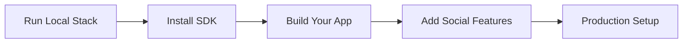

This guide walks you through building a first Pubky app against a local development stack. You will start a local Homeserver with Pubky Docker, create a Vite app, install the Pubky SDK, and connect your app to the local testnet.

By the end, you will have created a demo identity, signed up and signed in on the local Homeserver, written a JSON file to Pubky storage, and read it back in the browser. After that, you will also get to know the templates you can use to bootstrap your own Pubky app.

To follow along, you will need [Docker](https://docs.docker.com/get-started/get-docker/) and [npm](https://docs.npmjs.com/downloading-and-installing-node-js-and-npm/).

### Step 1: Set Up Pubky Docker

:::note[Prefer a native setup?]
If you do not want to use Docker, see the [native Pubky testnet setup](https://github.com/pubky/pubky-homeserver/blob/main/pubky-testnet/README.md).
:::

In order to build our App we'll need to setup a local homeserver and testnet - we'll use [Pubky Docker](/explore/technologies/pubky-docker/) to spin up a local development environment.

Note: [Pubky Docker](/explore/technologies/pubky-docker/)  can run a full [pubky.app](/explore/pubky-apps/reference-app/pubky-app/)-compatible social stack too, but we will keep this setup minimal.

```bash
git clone https://github.com/pubky/pubky-docker.git && cd pubky-docker && cp .env-sample .env
```

In `homeserver.config.toml` set `signup_mode` to `open`. This is as opposed to requiring a signup token to signup - local setups do not need the token-based spam protection used by public Homeservers.

From the `pubky-docker` directory, run:

```bash
sed -i 's/^signup_mode = "token_required"/signup_mode = "open"/' homeserver.config.toml
```

Run the homeserver and tesnet via Docker compose:

```bash
docker compose up homeserver -d
```

You now have a local Pubky testnet ready for app development. An isolated DHT is running, the HTTP relay is local, and the Homeserver publishes its PKARR identity to the local DHT. This means local clients can discover your Homeserver the same way they would on the public network, but everything stays on your machine. Your testnet Homeserver's pubky is always `8pinxxgqs41n4aididenw5apqp1urfmzdztr8jt4abrkdn435ewo`.

:::note[Testnet state is ephemeral]
When the Docker containers are restarted the files stored on the Homeserver and user PKARR records in the local DHT are reset. The testnet Homeserver does however have a stable, predefined pubky.
:::

With `.env` set to the default `NETWORK=testnet`, these ports are exposed:

| Port | Service | Purpose |
| --- | --- | --- |
| `15411` | [PKARR](/explore/pubky-protocol/pkarr/introduction/) relay | Used by the Pubky SDK to publish and resolve testnet PKARR records over HTTP, instead of using the [Mainline DHT](/explore/technologies/mainline-dht/). |
| `15412` | [HTTP relay](/explore/technologies/http-relay/) | Runs the local relay used by Pubky authentication flows. |
| `6286` | Homeserver ICANN HTTP | Clear-text HTTP endpoint used for browser and localhost fallback. |
| `6287` | Homeserver [PubkyTLS](/glossary/#pubkytls) | Direct Pubky TLS endpoint for SDK and native clients. |
| `6288` | Homeserver admin HTTP | Local admin endpoint exposed by Pubky Docker. |

:::note[Pubky CLI]
For manual user and Homeserver operations while developing locally, you can use [Pubky CLI](https://github.com/pubky/pubky-homeserver/tree/main/examples/javascript).
:::

For source builds, see [Optional: Build from source](/explore/technologies/pubky-docker/#build-from-source).

### Step 2: Initialize Project with the SDK

What follows is a step-by-step guide to building your first Pubky app. If you prefer to start from a ready-made project, jump to the [basic Pubky app template](#38-basic-pubky-app-template).

:::note[Reference docs]
For full API details see the reference documenation for [JavaScript](https://pubky.github.io/pubky-homeserver/js-sdk-typedoc/) and [Rust](https://docs.rs/pubky).
:::

With the Homeserver running, clone this empty Vite template and install the [Pubky SDK](/explore/pubky-protocol/sdk/):

```bash
npx tiged pubky/pubky-app-templates/vite-starter pubky-hello-world
cd pubky-hello-world
npm install && npm install @synonymdev/pubky
```

NPM package: [@synonymdev/pubky](https://www.npmjs.com/package/@synonymdev/pubky)

<details>
<summary><strong>Other tools and platforms</strong></summary>

If you are using another language, package manager, or framework, install the SDK like this. Dedicated guides for these will follow.

**Yarn:**
```bash
yarn add @synonymdev/pubky
```

**Rust ([docs](https://docs.rs/pubky)):**
```bash
cargo add pubky
```

**React Native:**
```bash
npm install @synonymdev/react-native-pubky
cd ios && pod install  # iOS only
```

**iOS/Android Native**: See [SDK Documentation](/explore/pubky-protocol/sdk/) for UniFFI bindings via `pubky-core-ffi`.

</details>

### Step 3: Build Your First App

Open `src/main.ts` and replace the `document.querySelector('#app')!.textContent = 'Vite Starter'` line with the snippets below.

#### 3.1 Import the SDK and enable info logs

```js snippet="snippets/js/src/getting-started.ts:js_getting_started_imports"
```

This loads the Pubky SDK and sends info logs to the browser console.

To see the logs in your browser console, make sure you have the right log level filtering configured in your browser as well.

#### 3.2 Connect to the local testnet

```js snippet="snippets/js/src/getting-started.ts:js_getting_started_testnet"
```

This tells the SDK to use the local testnet services started by Pubky Docker instead of the production Pubky network.

#### 3.3 Create a new user identity

```js snippet="snippets/js/src/getting-started.ts:js_getting_started_identity"
```

This creates a demo user identity for the hello-world app. The signer uses it to perform identity actions such as signup and signin.

#### 3.4 Sign up on the local Homeserver

```js snippet="snippets/js/src/getting-started.ts:js_getting_started_signup"
```

This creates an account on the local Homeserver and publishes the user's Homeserver mapping (PKARR). Because local signup is set to `open`, we pass `null` instead of a signup token.

:::note[Homeserver signup]
This guide performs Homeserver signup inside the app because it is the shortest path to a working local example. In a real-world flow, however, Homeserver signup is not the responsibility of a Pubky app. Assume users already have an account on a Homeserver. If not, direct them to a separate signup flow, such as [the onboarding on pubky.app](https://pubky.app/onboarding/human), instead of implementing it in the app. The template in Step 3.8 follows this pattern.
:::

Run `npm run dev` and open the printed URL in your browser. Look at the logs in your browser console. You should see that the signup request succeeded and that you successfully published your Homeserver configuration (= PKARR).

:::note[404 during signup]
During first signup, the browser console may show a `404` for a request to `http://localhost:15411/<user-public-key>`. That can be normal: the SDK checks whether the new user's PKARR record exists before publishing it. If signup continues, you can ignore that `404`.
:::

#### 3.5 Sign in

```js snippet="snippets/js/src/getting-started.ts:js_getting_started_signin"
```

This creates a Homeserver session for the demo user.

#### 3.6 Write to Homeserver storage

```js snippet="snippets/js/src/getting-started.ts:js_getting_started_write"
```

This writes a simple JSON file onto the signed-in user's Homeserver public storage.

#### 3.7 Read the JSON back

```js snippet="snippets/js/src/getting-started.ts:js_getting_started_read"
```

This fetches the same JSON file from Homeserver storage and renders it in the template's `#app` element, proving that signup, signin, write, and read all worked.

Run `npm run dev` again and open the page. You should now see the data displayed there.

:::tip[First app complete]
Nice. Your first Pubky app works.
:::

#### 3.8 Basic Pubky app template

As a next step, try this template as a fuller starting point for a fresh Pubky app.

It includes a working browser app with local testnet configuration, identity creation, Homeserver signup and signin, and a Pubky auth flow. Treat it as a set of building blocks: copy the pieces your app needs, adapt the auth and storage flows, and replace the sample UI with your own experience.

```bash
npx tiged pubky/pubky-app-templates/basic-pubky-app my-pubky-app
cd my-pubky-app
npm install
```

Set a stable app ID in `src/config.ts`; it determines the storage path.

```bash
VITE_PUBKY_TESTNET=true npm run dev
```

##### Homeserver auth

The basic app offers two login paths. The right-side **New identity** panel is a development shortcut: it creates a keypair inside the app, signs up with the Homeserver, and signs in. The left-side **Sign in with Pubky Ring** panel shows the recommended authentication flow: the app initiates sign-in, while responsibility for key management and Homeserver signup remains with components outside the app.

For local development, you can use the [Pubky Ring Simulator](https://simulator.pubkyring.app/) as a browser-based stand-in for Pubky Ring.

The simulator is preconfigured to connect to your local testnet on `localhost`. Because the hosted version accesses services running on your device, your browser may ask whether `simulator.pubkyring.app` can access apps and services on your device or devices on your local network. Choose **Allow** to continue. If you prefer not to grant this permission, clone the simulator and follow its [development instructions](https://github.com/pubky/pubky-ring-simulator#development) to run it locally.

1. In `my-pubky-app`, use the left-side **Sign in with Pubky Ring** panel and click **Copy link**.
2. In the simulator, select **Shortcut** mode and paste the link into **Auth link**.
3. The simulator creates an identity, signs it up on your local Homeserver, then approves the request automatically.
4. Switch back to `my-pubky-app`. It polls the pending auth flow and signs in automatically once the simulator approves.
5. To test sign-in with different identities, use the Pubky Ring Simulator in **Regular** mode. It simulates Pubky Ring's identity management, letting you create and select an identity before authorizing a request.

That flow is the security best practice: it keeps the user's key material out of the application being tested. The Pubky app template receives a session after authorization, but the identity and Homeserver setup remain with the signer.

### Step 4: Add Social Features

:::note[Guide coming soon]
For now, this section collects references. A dedicated guide will follow.
:::

**Learn from working examples:**
- [mypubky.com](https://mypubky.com/) ([source](https://github.com/pubky/mypubky))
- [eventky.app](https://eventky.app/) ([source](https://github.com/gillohner/eventky))
- [mapky.app](https://mapky.app/) ([source](https://github.com/gillohner/mapky-app))

**Social App (Pubky App Specs):**
- [pubky-app-specs](https://github.com/pubky/pubky-app-specs) - Data models for social features and interoperability with [pubky.app](/explore/pubky-apps/reference-app/pubky-app/)
- [npm: pubky-app-specs](https://www.npmjs.com/package/pubky-app-specs) / [crates.io: pubky-app-specs](https://crates.io/crates/pubky-app-specs)

**Use Pubky Nexus for Social Features:**

If building a social app, leverage [Pubky Nexus](/explore/pubky-apps/indexing-and-aggregation/pubky-nexus/) for:
- Real-time feeds and timelines
- Search and discovery
- User recommendations
- Notifications

```javascript snippet="snippets/js/src/quick-start-getting-started.ts:js_nexus_global_feed"
```

📊 [Nexus API Docs](https://nexus.pubky.app/swagger-ui/)

**Add Payments (WIP):**

[Paykit](/explore/technologies/paykit/) protocol (work in progress) will enable:
- Payment discovery via Pubky public keys
- Public or private payment details for Bitcoin onchain, Lightning, and other rails
- Encrypted receipt access for payers
- Subscriptions and payment request workflows

**Add Encryption (WIP):**

[Pubky Noise](/explore/technologies/pubky-noise/) (work in progress) provides:
- Encrypted peer-to-peer channels
- Private messaging
- Secure data sharing

### Step 5: Production Setup

To connect your app to the production Pubky network, replace the client from Step 3.2:

```diff
- const pubky = Pubky.testnet();
+ const pubky = new Pubky();
```

`new Pubky()` stops using the local endpoints. The app instead resolves [PKARR](/explore/pubky-protocol/pkarr/introduction/) records from the [Mainline DHT](/explore/technologies/mainline-dht/), connects to the Homeserver resolved from each user's PKARR record, and uses a public [HTTP relay](/explore/technologies/http-relay/) for authentication.

Steps 3.3–3.5 use development-only identity and Homeserver shortcuts. For production, use [Pubky Ring](/explore/technologies/pubky-ring/); the [basic Pubky app template](#38-basic-pubky-app-template) already implements that flow.

<details>
<summary><strong>Optional: Configure custom relays</strong></summary>

Browsers cannot query the UDP-based Mainline DHT directly, so the SDK uses HTTPS gateways called **PKARR relays**. See the [current default relay list](https://github.com/pubky/pkarr/blob/main/pkarr/src/lib.rs). To use custom PKARR relays:

```javascript snippet="snippets/js/src/troubleshooting.ts:js_pkarr_relay_config"
```

PKARR relays are separate from the [HTTP relay](/explore/technologies/http-relay/) that transfers encrypted Pubky Ring authentication messages. To use a custom HTTP relay with the SDK:

```javascript snippet="snippets/js/src/getting-started.ts:js_custom_auth_relay"
```

The basic template maps [`VITE_PUBKY_HTTP_RELAY`](https://github.com/pubky/pubky-app-templates/blob/main/basic-pubky-app/src/config.ts) to the same SDK option.

</details>

#### Test the Setup

1. Start the production-configured app and authenticate through Pubky Ring with your production identity.
2. Use the app to create some sample data.
3. Enter your pubky in [Pubky Explorer](https://explorer.pubky.app) and verify the files created by the app.

### Guides Coming Next

- **Other languages and platforms**: Build the same hello-world app with Rust, React Native, and native mobile tooling.
- **Run the Homeserver natively**: Start the local testnet without Docker Compose and configure local signup.
- **Build social Pubky apps**: Use the larger Pubky Docker stack with indexers, aggregators, and [pubky.app](/explore/pubky-apps/reference-app/pubky-app/)-compatible data flows.

### Next Steps

- **Explore SDK examples:** See the [Pubky Homeserver examples](https://github.com/pubky/pubky-homeserver/tree/main/examples) for runnable workflows.
- **Browse practical snippets:** See the [Pubky SDK guide](/explore/pubky-protocol/sdk/) for storage, authentication, events, sessions, and testing.
- **Choose an app architecture:** Compare [client-only, aggregator, and custom-backend designs](/explore/pubky-apps/app-architectures/introduction/).
- **Security model:** Review the [security considerations for app developers](/explore/pubky-protocol/security-model/#for-app-developers).

Need help? See [Troubleshooting](/troubleshooting/) or ask in [Telegram](https://t.me/pubkycore).

---

## Common First Questions

**Q: Do users need to download Pubky Ring to use my app?**
A: Currently yes for secure key management, though apps can implement their own key storage. Pubky Ring provides the best UX for multi-app identity.

**Q: Is Pubky compatible with Nostr/Bluesky/etc?**
A: Not directly. Pubky uses a different architecture (Homeservers + PKARR vs relays/PDSs). See [Comparisons](/comparisons/) for details.

**Q: How do I handle user authentication?**
A: The SDK handles it automatically via signature-based auth. No passwords, OAuth, or tokens needed. See [Authentication](/explore/pubky-protocol/authentication/).

**Q: Can I build private apps?**
A: Currently Pubky is optimized for public data. Private/encrypted features are coming via [Pubky Noise](/explore/technologies/pubky-noise/).

**Q: How do I make money?**
A: Several models work: Homeserver hosting, indexing services (like Nexus), premium features, or payments via [Paykit](/explore/technologies/paykit/) (WIP).

---

## Resources

### Documentation
- **[Main Documentation](/)**: Complete knowledge base
- **[Glossary](/glossary/)**: Quick term reference
- **[FAQ](/faq/)**: 63+ questions answered
- **[TLDR](/tldr/)**: 30-second overview

### Technical
- **[API Reference](/explore/pubky-protocol/api/)**: HTTP API spec
- **[SDK Guide](/explore/pubky-protocol/sdk/)**: Client library docs
- **[Rust Docs](https://docs.rs/pubky)**: Rust crate documentation
- **[Official Docs](https://pubky.github.io/pubky-homeserver/)**: Protocol specification

### Community
- **Telegram**: [t.me/pubkycore](https://t.me/pubkycore)
- **GitHub**: [github.com/pubky](https://github.com/pubky)
- **Live App**: [pubky.app](https://pubky.app)
