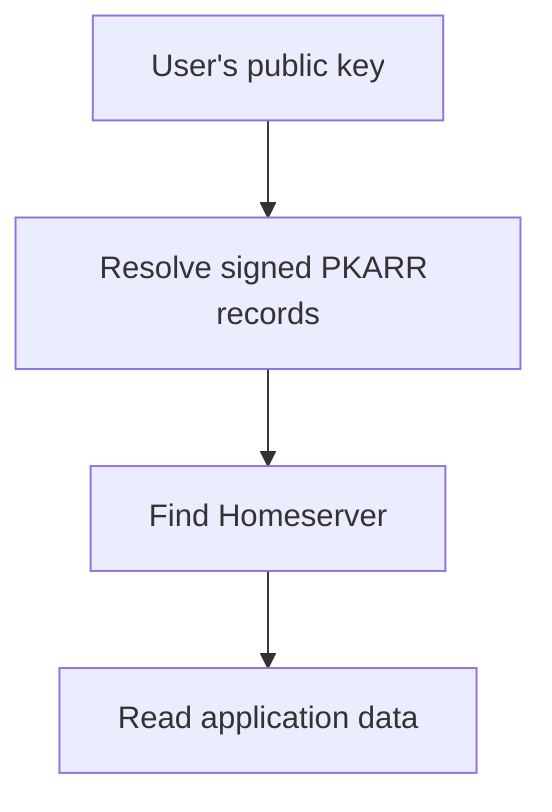

PKARR (Public-Key Addressable Resource Records) associates a public key with signed discovery records. In Pubky, these records connect a user's identity to their Homeserver, so the identity can stay the same when the hosting location changes.

## Finding someone without fixing their location

A public key is a stable identifier, but it does not tell an app which server to contact. PKARR supplies that missing step: the identity owner signs a small set of records describing where services can be reached. Those records are distributed through the [Mainline DHT](/explore/technologies/mainline-dht/), a network of nodes that can store and look up records by key.

For Pubky, this means an app can start with a user's public key, discover their Homeserver, and then fetch a file. Posts and profiles stay on the Homeserver; they are not stored in the DHT.

The records use DNS's familiar record format, but publishing an identity's PKARR records does not require registering a conventional domain name. When hosting changes, new records can point to the new location while the public key remains the same. The signature lets clients verify who authorized a discovery record; it does not authenticate the contents of files served by that host.

## What applications need to account for

Records need to be republished to remain available, and caches can delay changes. Browser applications can use PKARR relays to reach discovery services. These are separate from the [HTTP Relay](/explore/technologies/http-relay/) used during app authorization.

Pubky app developers normally use the [Pubky SDK](/explore/pubky-protocol/sdk/) to handle discovery. [PKDNS](/explore/technologies/pkdns/) provides a bridge for software that uses conventional DNS.

## Go deeper

The PKARR repository maintains the detailed explanations and integration instructions:

- [Introduction](https://github.com/pubky/pkarr/blob/main/docs/introduction.md): motivation, concepts, and trade-offs.
- [Quickstart](https://github.com/pubky/pkarr/blob/main/docs/quickstart.md): publishing and resolving records.
- [Integration Guide](https://github.com/pubky/pkarr/blob/main/docs/integration.md): application configuration, browser support, caching, and republishing.
- [Specifications](https://github.com/pubky/pkarr/tree/main/design): packet format, relays, endpoint discovery, and TLS.
