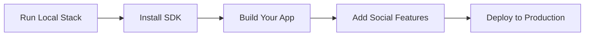

Build on Pubky if you want your users to control their identities and publish data to a Homeserver they choose, rather than to a data server dictated by and tied to whichever app they use. Pubky’s architecture preserves their freedom to move between apps and Homeservers.



Prerequisites: Docker and npm.

### Step 1: Set Up Pubky Docker

:::note[Native setup coming soon]
A native, non-Docker guide that covers running the same local testnet natively will follow.
:::

We'll use [Pubky Docker](/explore/technologies/pubky-docker/) for the local development environment:

```bash
git clone https://github.com/pubky/pubky-docker.git
cd pubky-docker
cp .env-sample .env
```

In `homeserver.config.toml`, set local signup mode to `open`. Local setups do not need the token-based spam protection used by public Homeservers.

```toml
signup_mode = "open"
```

For this first app, you only need the [Homeserver](/explore/pubkycore/homeserver/) (its db container starts automatically). Pubky Docker can run a full [pubky.app](/explore/pubky-apps/reference-app/pubky-app/)-compatible social stack too, but we will keep this setup minimal:

```bash
docker compose up homeserver -d
```

You now have a local Pubky testnet: the DHT is local, PKARR records resolve to local endpoints, the HTTP relay runs locally, and your testnet Homeserver's pubky is always `8pinxxgqs41n4aididenw5apqp1urfmzdztr8jt4abrkdn435ewo`.

:::note[Testnet state is ephemeral]
When the Docker containers are restarted, files stored on the Homeserver, user PKARR records in the local DHT, and HTTP relay auth state are reset. The testnet Homeserver has a stable, predefined pubky, so your app can keep connecting to the same Homeserver address.
:::

With `.env` set to the default `NETWORK=testnet`, these ports are exposed:

| Port | Service | Purpose |
| --- | --- | --- |
| `15411` | [PKARR](/explore/pubkycore/pkarr/introduction/) relay | Used by the Pubky SDK to publish and resolve testnet PKARR records over HTTP, instead of using the [Mainline DHT](/explore/technologies/mainline-dht/). |
| `15412` | [HTTP relay](/explore/technologies/http-relay/) | Runs the local relay used by Pubky authentication flows. |
| `6286` | Homeserver ICANN HTTP | Clear-text HTTP endpoint used for browser and localhost fallback. |
| `6287` | Homeserver [PubkyTLS](/glossary/#pubkytls) | Direct Pubky TLS endpoint for SDK and native clients. |
| `6288` | Homeserver admin HTTP | Local admin endpoint exposed by Pubky Docker. |

#### Optional: Build from source

For most app development, the public Docker images are enough. Build from source if you need exact control over which Pubky component versions run locally, or if you want to modify the stack itself.

To build from source, you need the Pubky component repositories. The easiest path is to let the helper script clone and prepare them for you:

```bash
./pubky-docker-cli.sh
```

The script pulls the required repositories, lets you choose Git refs for each component, builds the images, and starts the stack. To inspect which component versions are running in your containers, use:

```bash
./list-component-versions.sh
```

See the [Pubky Docker source setup instructions](https://github.com/pubky/pubky-docker#local-setup-from-source) for more details.

### Step 2: Initialize a Project with the SDK

With the Homeserver running, initialize a small TypeScript app and install the [Pubky SDK](/explore/pubkycore/sdk/):

```bash
npm create vite@latest pubky-hello-world -- --template vanilla-ts
cd pubky-hello-world
npm install @synonymdev/pubky
```

NPM package: [@synonymdev/pubky](https://www.npmjs.com/package/@synonymdev/pubky)

#### Other tools and platforms

If you are using another language, package manager, or framework, install the SDK like this. Dedicated guides for these will follow.

**Yarn:**
```bash
yarn add @synonymdev/pubky
```

**Rust ([docs](https://docs.rs/pubky)):**
```bash
cargo add pubky
```

**React Native:**
```bash
npm install @synonymdev/react-native-pubky
cd ios && pod install  # iOS only
```

**iOS/Android Native**: See [SDK Documentation](/explore/pubkycore/sdk/) for UniFFI bindings via `pubky-core-ffi`.

### Step 3: Build Your First App

:::note[Use an existing Pubky account]
For the first app, assume the user already has an account on a Homeserver. Pubky apps usually ask users to sign in and authorize capabilities; they do not own the signup flow, because user data lives on the user's Homeserver. If a user does not have an account yet, send them to [pubky.app](https://pubky.app), where they can create one on the Pubky Homeserver. Local signup docs are still evolving: `token_required` protects public Homeservers from signup spam, while `open` is only for local development where that protection gets in the way.
:::

**Quick Example (JavaScript):**

```javascript snippet="snippets/js/src/quick-start-getting-started.ts:js_getting_started_quick_example"
```

**Key concepts:**
- Data is stored per public key on Homeservers
- Path structure: `/pub/app-name/path` for public data
- All operations use standard HTTP/HTTPS
- Authentication via cryptographic signatures

📖 **Full SDK guide**: [SDK Documentation](/explore/pubkycore/sdk/)

### Step 4: Explore Example Apps

Learn from working examples:

**Social App (Pubky App Specs):**
- [pubky-app-specs](https://github.com/pubky/pubky-app-specs) - Data models for social features
- [npm: pubky-app-specs](https://www.npmjs.com/package/pubky-app-specs) / [crates.io: pubky-app-specs](https://crates.io/crates/pubky-app-specs) - Validation schemas and helper APIs

**CLI Tool:**
- [Pubky CLI](/explore/technologies/pubky-cli/) - Reference implementation for user/admin operations
- [Source](https://github.com/pubky/pubky-cli)

**Simple Examples:**
- [pubky-core/examples](https://github.com/pubky/pubky-core/tree/main/examples) - Rust examples
- Authentication flows
- Data storage patterns

### Step 5: Integrate Advanced Features

**Use Pubky Nexus for Social Features:**

If building a social app, leverage [Pubky Nexus](/explore/pubky-apps/indexing-and-aggregation/pubky-nexus/) for:
- Real-time feeds and timelines
- Search and discovery
- User recommendations
- Notifications

```javascript snippet="snippets/js/src/quick-start-getting-started.ts:js_nexus_global_feed"
```

📊 [Nexus API Docs](https://nexus.pubky.app/swagger-ui/)

**Add Payments (WIP):**

[Paykit](/explore/technologies/paykit/) protocol (work in progress) will enable:
- Payment discovery via Pubky public keys
- Public or private payment details for Bitcoin onchain, Lightning, and other rails
- Encrypted receipt access for payers
- Subscriptions and payment request workflows

**Add Encryption (WIP):**

[Pubky Noise](/explore/technologies/pubky-noise/) (work in progress) provides:
- Encrypted peer-to-peer channels
- Private messaging
- Secure data sharing

### Step 6: Deploy to Production

**Deploy a Homeserver:**

1. Set up a server (VPS, cloud, or self-hosted)
2. Configure HTTPS (required)
3. Deploy Homeserver:
   ```bash
   docker build --build-arg TARGETARCH=x86_64 -t pubky:core .
   docker run --network=host -it pubky:core
   ```
4. Publish Homeserver location to PKARR
5. Configure rate limiting and moderation

📘 **Guide**: [Homeserver Documentation](/explore/pubkycore/homeserver/)

**Signup Verification:**

Use [Homegate](/explore/technologies/homegate/) to prevent spam:
- SMS verification (rate-limited per phone)
- Lightning payment verification
- Open-source and self-hostable

**DNS Resolution:**

Run a [PKDNS](/explore/technologies/pkdns/) server for your users:
- Resolves public-key domains
- Supports traditional DNS
- DoH/DoT encryption

### Next Steps

- **Read the docs**: [Pubky Core Overview](/explore/pubkycore/introduction/)
- **Study the architecture**: [Architecture Overview](/architecture/)
- **Join the community**: [Telegram](https://t.me/pubkycore)
- **Check the FAQ**: [FAQ](/faq/)
- **Review comparisons**: [Comparisons](/comparisons/) with other protocols
- **Troubleshooting**: [Troubleshooting](/troubleshooting/) guide

---

## Common First Questions

**Q: Do users need to download Pubky Ring to use my app?**
A: Currently yes for secure key management, though apps can implement their own key storage. Pubky Ring provides the best UX for multi-app identity.

**Q: Is Pubky compatible with Nostr/Bluesky/etc?**
A: Not directly. Pubky uses a different architecture (Homeservers + PKARR vs relays/PDSs). See [Comparisons](/comparisons/) for details.

**Q: How do I handle user authentication?**
A: The SDK handles it automatically via signature-based auth. No passwords, OAuth, or tokens needed. See [Authentication](/explore/pubkycore/authentication/).

**Q: Can I build private apps?**
A: Currently Pubky is optimized for public data. Private/encrypted features are coming via [Pubky Noise](/explore/technologies/pubky-noise/).

**Q: How do I make money?**
A: Several models work: Homeserver hosting, indexing services (like Nexus), premium features, or payments via [Paykit](/explore/technologies/paykit/) (WIP).

---

## Resources

### Documentation
- **[Main Documentation](/)**: Complete knowledge base
- **[Glossary](/glossary/)**: Quick term reference
- **[FAQ](/faq/)**: 63+ questions answered
- **[TLDR](/tldr/)**: 30-second overview

### Technical
- **[API Reference](/explore/pubkycore/api/)**: HTTP API spec
- **[SDK Guide](/explore/pubkycore/sdk/)**: Client library docs
- **[Rust Docs](https://docs.rs/pubky)**: Rust crate documentation
- **[Official Docs](https://pubky.github.io/pubky-core/)**: Protocol specification

### Tools
- **[Pubky Docker](/explore/technologies/pubky-docker/)**: Local development stack
- **[Pubky CLI](/explore/technologies/pubky-cli/)**: Command-line interface
- **[Pubky Explorer](/explore/technologies/pubky-explorer/)**: Data browser

### Community
- **Telegram**: [t.me/pubkycore](https://t.me/pubkycore)
- **GitHub**: [github.com/pubky](https://github.com/pubky)
- **Live App**: [pubky.app](https://pubky.app)

---

**Ready to build the decentralized web? Start with the [SDK](/explore/pubkycore/sdk/)!**
