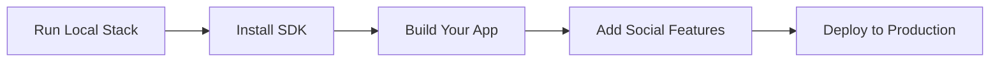

Prerequisites: Docker and npm.

### Step 1: Set Up Pubky Docker

:::note[Native setup coming soon]
A native, non-Docker guide that covers running the same local testnet natively will follow.
:::

We'll use [Pubky Docker](/explore/technologies/pubky-docker/) for the local development environment:

```bash
git clone https://github.com/pubky/pubky-docker.git
cd pubky-docker
cp .env-sample .env
```

In `homeserver.config.toml` set local signup mode to `open`. This is as opposed to requiring a signup token to signup - local setups do not need the token-based spam protection used by public Homeservers.

```toml
signup_mode = "open"
```

For this first app, you only need the [Homeserver](/explore/pubkycore/homeserver/) (its db container starts automatically). Pubky Docker can run a full [pubky.app](/explore/pubky-apps/reference-app/pubky-app/)-compatible social stack too, but we will keep this setup minimal:

```bash
docker compose up homeserver -d
```

You now have a local Pubky testnet: the DHT is local, PKARR records resolve to local endpoints, the HTTP relay runs locally, and your testnet Homeserver's pubky is always `8pinxxgqs41n4aididenw5apqp1urfmzdztr8jt4abrkdn435ewo`.

:::note[Testnet state is ephemeral]
When the Docker containers are restarted, files stored on the Homeserver, user PKARR records in the local DHT, and HTTP relay auth state are reset. The testnet Homeserver has a stable, predefined pubky, so your app can keep connecting to the same Homeserver address.
:::

With `.env` set to the default `NETWORK=testnet`, these ports are exposed:

| Port | Service | Purpose |
| --- | --- | --- |
| `15411` | [PKARR](/explore/pubkycore/pkarr/introduction/) relay | Used by the Pubky SDK to publish and resolve testnet PKARR records over HTTP, instead of using the [Mainline DHT](/explore/technologies/mainline-dht/). |
| `15412` | [HTTP relay](/explore/technologies/http-relay/) | Runs the local relay used by Pubky authentication flows. |
| `6286` | Homeserver ICANN HTTP | Clear-text HTTP endpoint used for browser and localhost fallback. |
| `6287` | Homeserver [PubkyTLS](/glossary/#pubkytls) | Direct Pubky TLS endpoint for SDK and native clients. |
| `6288` | Homeserver admin HTTP | Local admin endpoint exposed by Pubky Docker. |

:::note[Pubky CLI]
For manual user and Homeserver operations while developing locally, you can use [Pubky CLI](/explore/technologies/pubky-cli/).
:::

<details>
<summary><strong>Optional: Build from source</strong></summary>

For most app development, the public Docker images are enough. Build from source if you need exact control over which Pubky component versions run locally, or if you want to modify the stack itself.

To build from source, you need the Pubky component repositories. The easiest path is to let the helper script clone and prepare them for you:

```bash
./pubky-docker-cli.sh
```

The script pulls the required repositories, lets you choose Git refs for each component, builds the images, and starts the stack. To inspect which component versions are running in your containers, use:

```bash
./list-component-versions.sh
```

See the [Pubky Docker source setup instructions](https://github.com/pubky/pubky-docker#local-setup-from-source) for more details.

</details>

### Step 2: Initialize Project with the SDK

What follows is a step-by-step guide to building your first Pubky app. If you prefer to start from a ready-made project, jump to the [basic Pubky app template](#basic-pubky-app-template).

With the Homeserver running, clone this empty Vite template and install the [Pubky SDK](/explore/pubkycore/sdk/):

```bash
npx tiged pubky/pubky-app-templates/vite-starter pubky-hello-world
cd pubky-hello-world
npm install
npm install @synonymdev/pubky
```

NPM package: [@synonymdev/pubky](https://www.npmjs.com/package/@synonymdev/pubky)

<details>
<summary><strong>Other tools and platforms</strong></summary>

If you are using another language, package manager, or framework, install the SDK like this. Dedicated guides for these will follow.

**Yarn:**
```bash
yarn add @synonymdev/pubky
```

**Rust ([docs](https://docs.rs/pubky)):**
```bash
cargo add pubky
```

**React Native:**
```bash
npm install @synonymdev/react-native-pubky
cd ios && pod install  # iOS only
```

**iOS/Android Native**: See [SDK Documentation](/explore/pubkycore/sdk/) for UniFFI bindings via `pubky-core-ffi`.

</details>

### Step 3: Build Your First App

Open `src/main.ts` and replace the `document.querySelector('#app')!.textContent = 'Vite Starter'` line with the snippets below.

#### 3.1 Import the SDK and enable info logs

```js snippet="snippets/js/src/getting-started.ts:js_getting_started_imports"
```

This loads the Pubky SDK and sends info logs to the browser console.

To see the logs in your browser console, make sure you have the right log level filtering configured in your browser as well.

#### 3.2 Connect to the local testnet

```js snippet="snippets/js/src/getting-started.ts:js_getting_started_testnet"
```

This tells the SDK to use the local testnet services started by Pubky Docker instead of the production Pubky network.

#### 3.3 Create a new user identity

```js snippet="snippets/js/src/getting-started.ts:js_getting_started_identity"
```

This creates a demo user identity for the hello-world app. The signer uses it to perform identity actions such as signup and signin.

#### 3.4 Sign up on the local Homeserver

```js snippet="snippets/js/src/getting-started.ts:js_getting_started_signup"
```

This creates an account on the local Homeserver and publishes the user's Homeserver mapping (PKARR). Because local signup is set to `open`, we pass `null` instead of a signup token.

Run `npm run dev` and open the printed URL in your browser. Look at the logs in your browser console. You should see that the signup request succeeded and that you successfully published your Homeserver configuration (= PKARR).

:::note[404 during signup]
During first signup, the browser console may show a `404` for a request to `http://localhost:15411/<user-public-key>`. That can be normal: the SDK checks whether the new user's PKARR record exists before publishing it. If signup continues, you can ignore that `404`.
:::

#### 3.5 Sign in

```js snippet="snippets/js/src/getting-started.ts:js_getting_started_signin"
```

This creates a Homeserver session for the demo user.

#### 3.6 Write to Homeserver storage

```js snippet="snippets/js/src/getting-started.ts:js_getting_started_write"
```

This writes a simple JSON file onto the signed-in user's Homeserver public storage.

#### 3.7 Read the JSON back

```js snippet="snippets/js/src/getting-started.ts:js_getting_started_read"
```

This fetches the same JSON file from Homeserver storage and renders it in the template's `#app` element, proving that signup, signin, write, and read all worked.

Run `npm run dev` again and open the page. You should now see the data displayed there.

:::tip[First app complete]
Nice. Your first Pubky app works.

To keep going, explore the [Pubky JavaScript examples](https://github.com/pubky/pubky-core/tree/main/examples/javascript) for extra building blocks.
:::

#### Basic Pubky app template

As a next step, try this template as a fuller starting point for a fresh Pubky app:

```bash
npx tiged pubky/pubky-app-templates/basic-pubky-app my-pubky-app
cd my-pubky-app
npm install
VITE_PUBKY_TESTNET=true npm run dev
```

### Step 4: Add Social Features

:::note[Guide coming soon]
For now, this section collects references. A dedicated guide will follow.
:::

**Learn from working examples:**
- [mypubky.com](https://mypubky.com/) ([source](https://github.com/pubky/mypubky))
- [eventky.app](https://eventky.app/) ([source](https://github.com/gillohner/eventky))
- [mapky.app](https://mapky.app/) ([source](https://github.com/gillohner/mapky-app))

**Social App (Pubky App Specs):**
- [pubky-app-specs](https://github.com/pubky/pubky-app-specs) - Data models for social features and interoperability with [pubky.app](/explore/pubky-apps/reference-app/pubky-app/)
- [npm: pubky-app-specs](https://www.npmjs.com/package/pubky-app-specs) / [crates.io: pubky-app-specs](https://crates.io/crates/pubky-app-specs)

**Use Pubky Nexus for Social Features:**

If building a social app, leverage [Pubky Nexus](/explore/pubky-apps/indexing-and-aggregation/pubky-nexus/) for:
- Real-time feeds and timelines
- Search and discovery
- User recommendations
- Notifications

```javascript snippet="snippets/js/src/quick-start-getting-started.ts:js_nexus_global_feed"
```

📊 [Nexus API Docs](https://nexus.pubky.app/swagger-ui/)

**Add Payments (WIP):**

[Paykit](/explore/technologies/paykit/) protocol (work in progress) will enable:
- Payment discovery via Pubky public keys
- Public or private payment details for Bitcoin onchain, Lightning, and other rails
- Encrypted receipt access for payers
- Subscriptions and payment request workflows

**Add Encryption (WIP):**

[Pubky Noise](/explore/technologies/pubky-noise/) (work in progress) provides:
- Encrypted peer-to-peer channels
- Private messaging
- Secure data sharing

### Step 5: Deploy to Production

**Deploy a Homeserver:**

1. Set up a server (VPS, cloud, or self-hosted)
2. Configure HTTPS (required)
3. Deploy Homeserver:
   ```bash
   docker build --build-arg TARGETARCH=x86_64 -t pubky:core .
   docker run --network=host -it pubky:core
   ```
4. Publish Homeserver location to PKARR
5. Configure rate limiting and moderation

📘 **Guide**: [Homeserver Documentation](/explore/pubkycore/homeserver/)

**Signup Verification:**

Use [Homegate](/explore/technologies/homegate/) to prevent spam:
- SMS verification (rate-limited per phone)
- Lightning payment verification
- Open-source and self-hostable

**DNS Resolution:**

Run a [PKDNS](/explore/technologies/pkdns/) server for your users:
- Resolves public-key domains
- Supports traditional DNS
- DoH/DoT encryption

### Guides Coming Next

- **Login with Pubky Ring**: Keep user keys out of the browser app and sign in through Pubky Auth. Apps request scoped capabilities, and users approve them in a dedicated signer such as [Pubky Ring](/explore/technologies/pubky-ring/).
- **Update Step 5: Deploy to Production**: Replace the current outline with a complete production guide for using the [Mainline DHT](/explore/technologies/mainline-dht/), signing in with [Pubky Ring](/explore/technologies/pubky-ring/), and making your app accessible on the internet.
- **Other languages and platforms**: Build the same hello-world app with Rust, React Native, and native mobile tooling.
- **Run the Homeserver natively**: Start the local testnet without Docker Compose and configure local signup.
- **Build social Pubky apps**: Use the larger Pubky Docker stack with indexers, aggregators, and [pubky.app](/explore/pubky-apps/reference-app/pubky-app/)-compatible data flows.

### Next Steps

- **Read the docs**: [Pubky Core Overview](/explore/pubkycore/introduction/)
- **Study the architecture**: [Architecture Overview](/architecture/)
- **Join the community**: [Telegram](https://t.me/pubkycore)
- **Check the FAQ**: [FAQ](/faq/)
- **Review comparisons**: [Comparisons](/comparisons/) with other protocols
- **Troubleshooting**: [Troubleshooting](/troubleshooting/) guide

---

## Common First Questions

**Q: Do users need to download Pubky Ring to use my app?**
A: Currently yes for secure key management, though apps can implement their own key storage. Pubky Ring provides the best UX for multi-app identity.

**Q: Is Pubky compatible with Nostr/Bluesky/etc?**
A: Not directly. Pubky uses a different architecture (Homeservers + PKARR vs relays/PDSs). See [Comparisons](/comparisons/) for details.

**Q: How do I handle user authentication?**
A: The SDK handles it automatically via signature-based auth. No passwords, OAuth, or tokens needed. See [Authentication](/explore/pubkycore/authentication/).

**Q: Can I build private apps?**
A: Currently Pubky is optimized for public data. Private/encrypted features are coming via [Pubky Noise](/explore/technologies/pubky-noise/).

**Q: How do I make money?**
A: Several models work: Homeserver hosting, indexing services (like Nexus), premium features, or payments via [Paykit](/explore/technologies/paykit/) (WIP).

---

## Resources

### Documentation
- **[Main Documentation](/)**: Complete knowledge base
- **[Glossary](/glossary/)**: Quick term reference
- **[FAQ](/faq/)**: 63+ questions answered
- **[TLDR](/tldr/)**: 30-second overview

### Technical
- **[API Reference](/explore/pubkycore/api/)**: HTTP API spec
- **[SDK Guide](/explore/pubkycore/sdk/)**: Client library docs
- **[Rust Docs](https://docs.rs/pubky)**: Rust crate documentation
- **[Official Docs](https://pubky.github.io/pubky-core/)**: Protocol specification

### Community
- **Telegram**: [t.me/pubkycore](https://t.me/pubkycore)
- **GitHub**: [github.com/pubky](https://github.com/pubky)
- **Live App**: [pubky.app](https://pubky.app)
