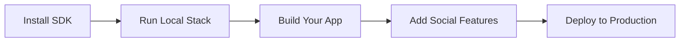

Build on Pubky if you want your users to control their identities and publish data to a Homeserver they choose, rather than to a data server dictated by and tied to whichever app they use. Pubky’s architecture preserves their freedom to move between apps and Homeservers.



## For Developers: Build on Pubky

### Step 1: Install the SDK

Choose your platform and install the [Pubky SDK](/explore/pubkycore/sdk/):

**Rust:**
```bash
cargo add pubky
```

**JavaScript/TypeScript (Web & Node.js):**
```bash
npm install @synonymdev/pubky
# or
yarn add @synonymdev/pubky
```

**React Native:**
```bash
npm install @synonymdev/react-native-pubky
cd ios && pod install  # iOS only
```

**iOS/Android Native**: See [SDK Documentation](/explore/pubkycore/sdk/) for UniFFI bindings via `pubky-core-ffi`.

📚 **Resources:**
- [Rust API Docs](https://docs.rs/pubky)
- [NPM Package](https://www.npmjs.com/package/@synonymdev/pubky)
- [Official Docs](https://pubky.github.io/pubky-core/)

### Step 2: Run Local Development Stack

**[Pubky Docker](/explore/technologies/pubky-docker/)** provides a one-command local setup of the full Pubky Social stack (PKARR relay, Homeserver, Nexus, and the App frontend).

See the [Pubky Docker documentation](/explore/technologies/pubky-docker/) for setup instructions, port mappings, and configuration options.

**Alternative**: Run just a Homeserver. Start PostgreSQL and configure `database_url` first; see the [Homeserver documentation](/explore/pubkycore/homeserver/) for details:
```bash
git clone https://github.com/pubky/pubky-core
cd pubky-core/pubky-homeserver
cargo run -- --data-dir=~/.pubky
```

### Step 3: Build Your First App

**Quick Example (JavaScript):**

```javascript snippet="snippets/js/src/quick-start-getting-started.ts:js_getting_started_quick_example"
```

**Key concepts:**
- Data is stored per public key on Homeservers
- Path structure: `/pub/app-name/path` for public data
- All operations use standard HTTP/HTTPS
- Authentication via cryptographic signatures

📖 **Full SDK guide**: [SDK Documentation](/explore/pubkycore/sdk/)

### Step 4: Explore Example Apps

Learn from working examples:

**Social App (Pubky App Specs):**
- [pubky-app-specs](https://github.com/pubky/pubky-app-specs) - Data models for social features
- [npm: pubky-app-specs](https://www.npmjs.com/package/pubky-app-specs) / [crates.io: pubky-app-specs](https://crates.io/crates/pubky-app-specs) - Validation schemas and helper APIs

**CLI Tool:**
- [Pubky CLI](/explore/technologies/pubky-cli/) - Reference implementation for user/admin operations
- [Source](https://github.com/pubky/pubky-cli)

**Simple Examples:**
- [pubky-core/examples](https://github.com/pubky/pubky-core/tree/main/examples) - Rust examples
- Authentication flows
- Data storage patterns

### Step 5: Integrate Advanced Features

**Use Pubky Nexus for Social Features:**

If building a social app, leverage [Pubky Nexus](/explore/pubky-apps/indexing-and-aggregation/pubky-nexus/) for:
- Real-time feeds and timelines
- Search and discovery
- User recommendations
- Notifications

```javascript snippet="snippets/js/src/quick-start-getting-started.ts:js_nexus_global_feed"
```

📊 [Nexus API Docs](https://nexus.pubky.app/swagger-ui/)

**Add Payments (WIP):**

[Paykit](/explore/technologies/paykit/) protocol (work in progress) will enable:
- Payment discovery via Pubky public keys
- Public or private payment details for Bitcoin onchain, Lightning, and other rails
- Encrypted receipt access for payers
- Subscriptions and payment request workflows

**Add Encryption (WIP):**

[Pubky Noise](/explore/technologies/pubky-noise/) (work in progress) provides:
- Encrypted peer-to-peer channels
- Private messaging
- Secure data sharing

### Step 6: Deploy to Production

**Deploy a Homeserver:**

1. Set up a server (VPS, cloud, or self-hosted)
2. Configure HTTPS (required)
3. Deploy Homeserver:
   ```bash
   docker build --build-arg TARGETARCH=x86_64 -t pubky:core .
   docker run --network=host -it pubky:core
   ```
4. Publish Homeserver location to PKARR
5. Configure rate limiting and moderation

📘 **Guide**: [Homeserver Documentation](/explore/pubkycore/homeserver/)

**Signup Verification:**

Use [Homegate](/explore/technologies/homegate/) to prevent spam:
- SMS verification (rate-limited per phone)
- Lightning payment verification
- Open-source and self-hostable

**DNS Resolution:**

Run a [PKDNS](/explore/technologies/pkdns/) server for your users:
- Resolves public-key domains
- Supports traditional DNS
- DoH/DoT encryption

### Next Steps

- **Read the docs**: [Pubky Core Overview](/explore/pubkycore/introduction/)
- **Study the architecture**: [Architecture Overview](/architecture/)
- **Join the community**: [Telegram](https://t.me/pubkycore)
- **Check the FAQ**: [FAQ](/faq/)
- **Review comparisons**: [Comparisons](/comparisons/) with other protocols
- **Troubleshooting**: [Troubleshooting](/troubleshooting/) guide

---

## Common First Questions

**Q: Do users need to download Pubky Ring to use my app?**
A: Currently yes for secure key management, though apps can implement their own key storage. Pubky Ring provides the best UX for multi-app identity.

**Q: Is Pubky compatible with Nostr/Bluesky/etc?**
A: Not directly. Pubky uses a different architecture (Homeservers + PKARR vs relays/PDSs). See [Comparisons](/comparisons/) for details.

**Q: How do I handle user authentication?**
A: The SDK handles it automatically via signature-based auth. No passwords, OAuth, or tokens needed. See [Authentication](/explore/pubkycore/authentication/).

**Q: Can I build private apps?**
A: Currently Pubky is optimized for public data. Private/encrypted features are coming via [Pubky Noise](/explore/technologies/pubky-noise/).

**Q: How do I make money?**
A: Several models work: Homeserver hosting, indexing services (like Nexus), premium features, or payments via [Paykit](/explore/technologies/paykit/) (WIP).

---

## Resources

### Documentation
- **[Main Documentation](/)**: Complete knowledge base
- **[Glossary](/glossary/)**: Quick term reference
- **[FAQ](/faq/)**: 63+ questions answered
- **[TLDR](/tldr/)**: 30-second overview

### Technical
- **[API Reference](/explore/pubkycore/api/)**: HTTP API spec
- **[SDK Guide](/explore/pubkycore/sdk/)**: Client library docs
- **[Rust Docs](https://docs.rs/pubky)**: Rust crate documentation
- **[Official Docs](https://pubky.github.io/pubky-core/)**: Protocol specification

### Tools
- **[Pubky Docker](/explore/technologies/pubky-docker/)**: Local development stack
- **[Pubky CLI](/explore/technologies/pubky-cli/)**: Command-line interface
- **[Pubky Explorer](/explore/technologies/pubky-explorer/)**: Data browser

### Community
- **Telegram**: [t.me/pubkycore](https://t.me/pubkycore)
- **GitHub**: [github.com/pubky](https://github.com/pubky)
- **Live App**: [pubky.app](https://pubky.app)

---

**Ready to build the decentralized web? Start with the [SDK](/explore/pubkycore/sdk/)!**
