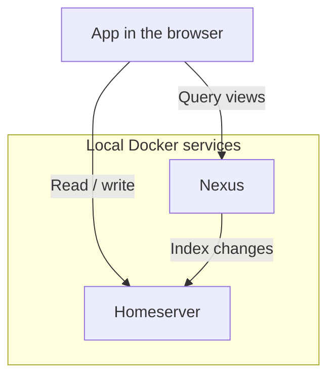

**[Pubky Docker](https://github.com/pubky/pubky-docker)** runs a full local Pubky environment, including Pubky Homeserver, Homegate, and the Pubky Social components Pubky Nexus and pubky.app.

Use it to develop an app against a disposable local testnet, or to test changes across the social application's components. The [Getting Started guide](/explore/pubky-protocol/getting-started/) uses it to provide a Homeserver for your first app. You do not need to run the full stack for every SDK integration.

:::caution[Warning]
Pubky Docker is intended for local development, testing, and experimentation—not production hosting.
:::

## Testnet Architecture

The stack includes a local DHT and PKARR relay for discovery, an HTTP relay for authentication, and Homegate for signup. A simple SDK app needs the Homeserver and local protocol services; the social stack also provides Nexus and pubky.app.

The browser can access stored data directly and use Nexus for indexed social views:

For authorization during local development, the [Ring Simulator](https://simulator.pubkyring.app/) can act as the authenticator. The [authentication overview](/explore/pubky-protocol/authentication/) explains that flow.

For setup, configuration, and running specific component revisions, see the [Pubky Docker README](https://github.com/pubky/pubky-docker/blob/main/Readme.md).
