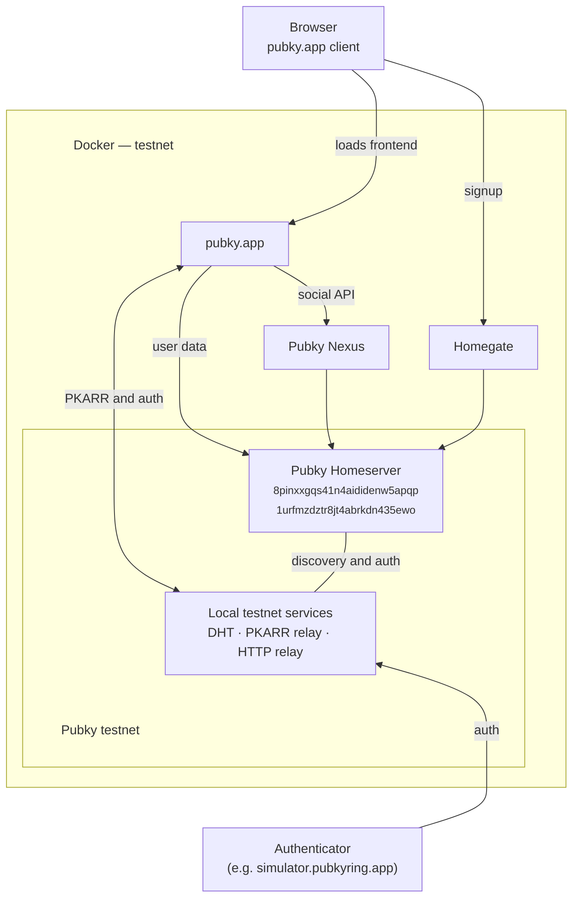

**[Pubky Docker](https://github.com/pubky/pubky-docker)** runs a full local Pubky environment, including Pubky Homeserver, Homegate, and the Pubky Social components Pubky Nexus and pubky.app.

:::caution[Warning]
Pubky Docker is intended for local development, testing, and experimentation—not production hosting.
:::

For current setup instructions, configuration, and development workflows, see the [Pubky Docker README](https://github.com/pubky/pubky-docker#readme).

## Testnet Architecture

The following simplified diagram shows the default local testnet topology. The DHT, [PKARR relay](/explore/pubky-protocol/pkarr/architecture/), and [HTTP relay](/explore/technologies/http-relay/) run locally inside the `homeserver` service.



## Build from Source

Build from source when you need to run specific component revisions or test changes to the stack.

Run [`pubky-docker-cli.sh`](https://github.com/pubky/pubky-docker/blob/main/pubky-docker-cli.sh) from the root of a cloned [Pubky Docker repository](https://github.com/pubky/pubky-docker):

```bash
./pubky-docker-cli.sh
```

The script pulls the required repositories, lets you choose Git refs, builds the images, and starts the stack. To inspect the running versions, use [`list-component-versions.sh`](https://github.com/pubky/pubky-docker/blob/main/list-component-versions.sh) from the same directory:

```bash
./list-component-versions.sh
```

See the [Pubky Docker source setup instructions](https://github.com/pubky/pubky-docker#local-setup-from-source) for more details.

## Links

- [Source repository](https://github.com/pubky/pubky-docker)
- [Published Docker images](https://hub.docker.com/u/synonymsoft)

## Related Documentation

- [Pubky Homeserver](/explore/pubky-protocol/homeserver/)
- [Pubky Nexus](/explore/pubky-apps/indexing-and-aggregation/pubky-nexus/)
- [Homegate](/explore/technologies/homegate/)
- [pubky.app](/explore/pubky-apps/reference-app/pubky-app/)
