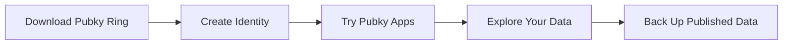

:::note[Developers Guide]
This guide helps you try Pubky **as a user**; if you want to build on Pubky, start with the [Developer Guide](/explore/pubkycore/getting-started/).
:::

Welcome to Pubky! You’ll create your identity, sign in to pubky.app, and inspect and back up the data you publish.



## Step 1: Download Pubky Ring

**[Pubky Ring](/explore/technologies/pubky-ring/)** is your key manager for the Pubky ecosystem. It stores your identity and lets you authorize Pubky apps without creating a platform-owned account.

- **iOS**: Download from the [App Store](https://apps.apple.com/us/app/pubky-ring/id6739356756)
- **Android**: Download from [Google Play](https://play.google.com/store/apps/details?id=to.pubky.ring)

[Official Website](https://pubkyring.app/) · [Official Repository](https://github.com/pubky/pubky-ring)

## Step 2: Create Your Pubky Identity And Profile

1. Visit **[pubky.app](https://pubky.app)**.
2. Click "Join now".
3. Enter your invite code if you have one. If not, depending on where you are located, you may be able to use SMS verification and/or Bitcoin payment verification. These checks help Homeserver operators prevent signup spam. They are *not* meant to invade your privacy or charge you for using the Homeserver. Other signup methods are in development.
4. Scan the QR code with your smartphone and open the link with Pubky Ring. The QR code contains your invite code.
5. Authorize pubky.app in Pubky Ring to write to `/pub/pubky.app` on your Homeserver. Homeservers only allow an app to write to the paths you approve. As of today, everything under `/pub/` is public by default, so read access does not require authorization.
6. Create your Pubky profile.
7. **Save your recovery phrase securely** - this is your master backup.
8. Your public key (pubky) is now your permanent identity!

Your pubky looks like this:

```text
z4e8s17cou9qmuwen8p1556jzhf1wktmzo6ijsfnri9c4hnrdfty
```

## Step 3: Try pubky.app

Once your profile is created, use **[pubky.app](https://pubky.app)** as a decentralized social media app built on Pubky.

1. Start posting, following, tagging, and exploring.
2. Reopen pubky.app later and sign in with the same Pubky Ring identity.

What makes it different:

- You define on which Homeserver your own data is stored. You are in control.
- Your feed is shaped by your choices, not by a platform’s engagement algorithm.
- Pubky is designed for [censorship resistance](/explore/concepts/censorship/) and [credible exit](/explore/concepts/credible-exit/).

## Explore Other Pubky Apps

Your Pubky Ring identity can be used across different Pubky apps. When you authorize another app, it can publish data on your Homeserver, instead of making you create a separate account for every application. As you sign in to these apps, notice how Pubky Ring asks you to approve access to specific paths on your Homeserver.

- **[mypubky](https://mypubky.com/)**: A shareable bio page for your profile, links, posts, and payment options.
- **[Payky](https://payky.app/)**: A payment profile for sharing your payment details, from crypto to fiat, in one link.
- **[Mapky](https://mapky.app/)**: A social map where your location-based data stays user-owned.
- **[Eventky](https://eventky.app/)**: A social calendar and event management app with event data stored on each user's Homeserver.

## Step 4: Explore Your Data

Use **[Pubky Explorer](/explore/technologies/pubky-explorer/)** ([explorer.pubky.app](https://explorer.pubky.app)) to browse your data.

1. Enter your pubky or navigate to a path.
2. Browse your files and directories.
3. See exactly what data you have published.
4. Share direct links to your public data.

Example paths:

- `pubky://your-key/pub/pubky.app/profile.json` - Your profile
- `pubky://your-key/pub/pubky.app/posts/` - Your posts directory

## Step 5: Back Up Your Published Data

Install **[Pubky Backup](/explore/technologies/pubky-backup/)** to keep local copies of the public `/pub/...` data stored on your Homeserver.

1. Download Pubky Backup from [github.com/pubky/pubky-backup](https://github.com/pubky/pubky-backup/releases).
2. Add your pubky public key.
3. Let the app sync in the background.
4. Create snapshots before migrating Homeservers or making major changes.

Pubky Backup does not replace your recovery phrase. The recovery phrase protects your identity key; Pubky Backup protects a local copy of your published data.

## Next Steps

- **Join the community**: [Telegram](https://t.me/pubkycore)
- **Learn more**: Read the [FAQ](/faq/)
- **Understand the tech**: Check out [ELI5: Pubky Core](/explore/pubkycore/eli5/)
- **Explore concepts**: Learn about the [Semantic Social Graph](/explore/concepts/semantic-social-graph/)

## Common First Questions

**Do I need Pubky Ring to use Pubky?**

Pubky Ring is the recommended way to manage your identity and authorize apps. It keeps your key material separate from individual apps.

**Can I use Pubky without running my own Homeserver?**

Yes. Users can choose a public Homeserver provider. Running your own is optional.

**Where is my data stored?**

Your public app data is stored on a Homeserver, which is linked to your pubky through [PKARR](/explore/pubkycore/pkarr/introduction/). You can change your Homeserver in Pubky Ring, and [Pubky Explorer](https://explorer.pubky.app) lets you inspect what is currently stored there.

## Resources

- **[FAQ](/faq/)**: Frequently asked questions
- **[Glossary](/glossary/)**: Quick term reference
- **[Pubky Ring](/explore/technologies/pubky-ring/)**: Key manager overview
- **[Pubky Explorer](/explore/technologies/pubky-explorer/)**: Data browser overview
- **[Pubky Backup](/explore/technologies/pubky-backup/)**: Desktop backup for published Homeserver data
